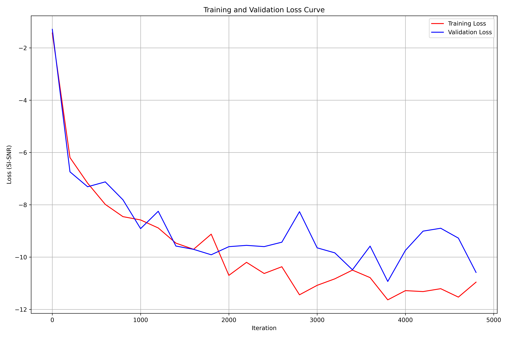
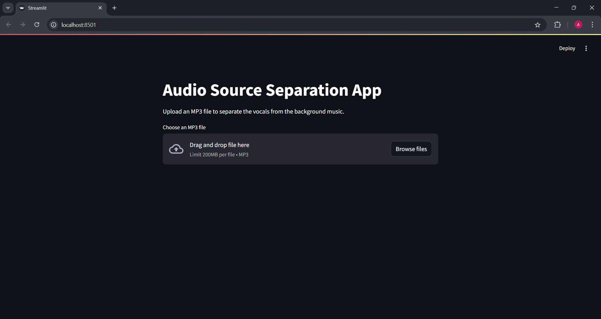

# Audio Source Separation with RNN (MIR-1K)

## Overview

This project is a deep learning-based tool for singing voice separation. It uses a Recurrent Neural Network (RNN) to split a song into two components: the singing voice (vocals) and the background music (accompaniment). The model is trained and evaluated on the MIR-1K dataset and provides both a command-line and a Streamlit web interface for easy use.

---

## Features

- **Source Separation:** Separates vocals and accompaniment from stereo audio.
- **Streamlit Web App:** Upload your own `.mp3` file and get separated audio instantly.
- **Training:** Easily train the model on the MIR-1K dataset.
- **SI-SNR Loss:** Uses Scale-Invariant Signal-to-Noise Ratio (SI-SNR) as the loss function for robust source separation.
- **Visualization:** Training and validation loss curves are plotted for monitoring.

---

## Dataset

- **MIR-1K**: 374 Chinese karaoke recordings, each mixed at three different signal-to-accompaniment ratios, resulting in 1122 audio clips.
- **Format:** Stereo `.wav` files (vocals in left channel, accompaniment in right).
- **Labels:** Human-labeled pitch, voiced/unvoiced, and vocal/non-vocal frame labels.
- **Usage:** Place the extracted `MIR-1K` folder in your project root. The main audio files should be in `MIR-1K/Wavfile/`.

---

## Model Architecture

- **Type:** Deep RNN (Stacked GRU layers)
- **Layers:** 4 GRU layers (default: 256 units each)
- **Output:** Two dense layers (for vocals and accompaniment masks)
- **Masking:** Softmax-based masking to separate sources in the frequency domain
- **Loss Function:** Scale-Invariant Signal-to-Noise Ratio (SI-SNR), which is robust to signal scaling and better suited for source separation than MSE.

---

## Training

- **Loss:** SI-SNR (Scale-Invariant Signal-to-Noise Ratio)
- **Optimizer:** Adam with gradient clipping
- **Logging:** Both training and validation losses are logged and plotted
- **Checkpoints:** Best and periodic model weights are saved in the `model/` directory

---

## Requirements

Install dependencies with:
```bash
pip install -r requirements.txt
```
**requirements.txt:**
```
streamlit
librosa
numpy
tensorflow
soundfile
mir_eval
```

---

## Usage

### 1. **Training**
Train the model on the MIR-1K dataset:
```bash
python train.py
```

### 2. **Plotting Loss Curves**
Plot both training and validation loss curves:
```bash
python utils.py
```
This will save the plot as `figures/train_validation_loss.png`.

### 3. **Main Demo (Command Line)**
Separate sources from `.mp3` files in the `songs/` directory:
```bash
python main.py
```
Outputs will be saved in the `main-demo/` directory.

### 4. **Streamlit Web App**
Run the web interface:
```bash
streamlit run app.py
```
- Upload an `.mp3` file.
- Download the separated vocals and background music.

---

## Example Outputs

**Training and Validation Loss Curves:**
<p align="center">
    
</p>

**Streamlit App:**
<p align="center">
    
</p>

**Separated Audio Example:**
- `main-demo/Bye Bye Bye_mono.wav`
- `main-demo/Bye Bye Bye_src1.wav` (vocals)
- `main-demo/Bye Bye Bye_src2.wav` (accompaniment)

---

## Project Structure

```
AS_V1.2/
│
├── MIR-1K/                # Dataset root
│   └── Wavfile/           # Main audio files
├── main-demo/             # Outputs from main demo
├── model/                 # Saved model weights
├── figures/               # Training/validation loss plots, app screenshots
├── train.py               # Training script
├── main.py                # Main demo script
├── app.py                 # Streamlit web app
├── utils.py               # Plotting utilities
├── requirements.txt
└── README.md
```

---

## To-Do

- Evaluate against other models (e.g., U-Net)
- Train on a larger dataset and/or with more layers
- Improve separation quality and robustness

---

## Acknowledgements

- **Dataset:** [MIR-1K](https://sites.google.com/site/unvoicedsoundseparation/mir-1k)
- **Libraries:** TensorFlow, librosa, Streamlit, mir_eval

---

If you need more details or want to customize the README further, let me know!

